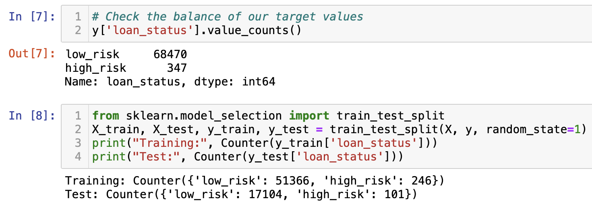
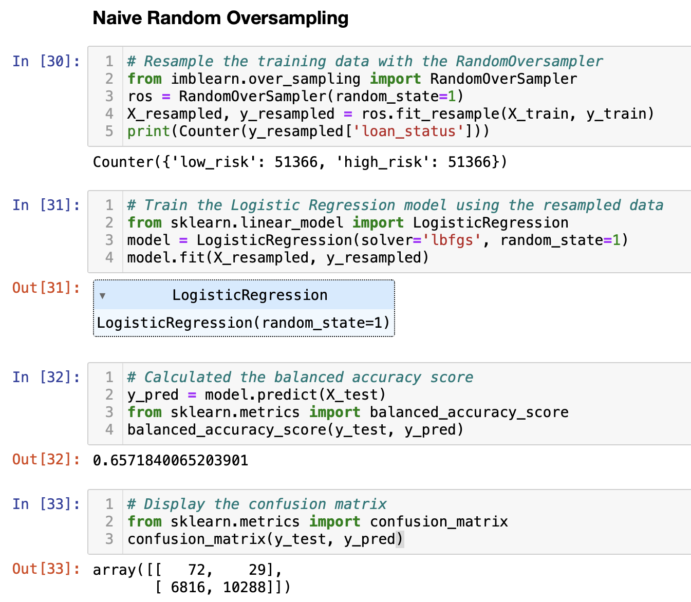
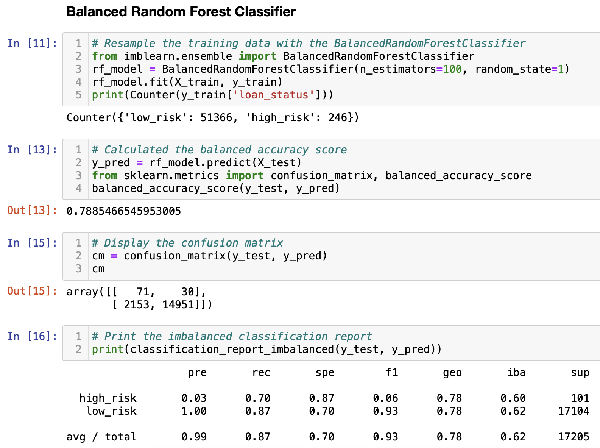
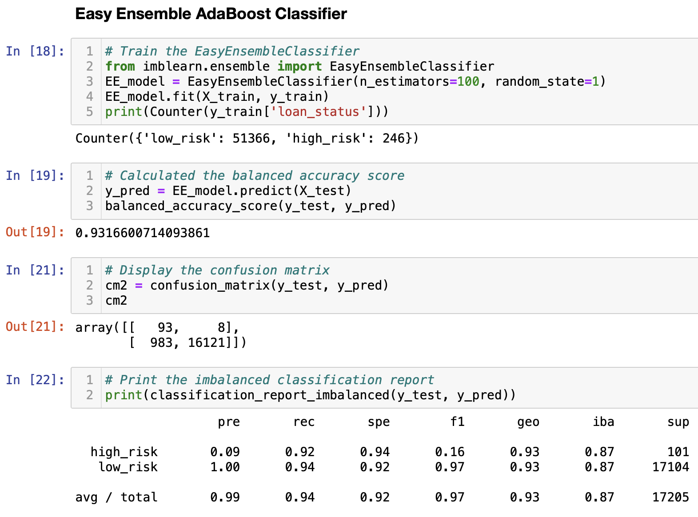

# Credit Risk Analysis

## Overview of the loan prediction risk analysis 

In this project we used statistical algorithms and Python to make predictions based on the data given, build, train  and evaluate machine learnings models. This models predicted the credit risk using imbalanced-learn and scikit-learn libraries with techniques suchs as resampling, some of the algorithms used were:

* RandomOverSampler
* SMOTE
* ClusterCentroids
* SMOTEENN
* BalancedRandomForestClassifier
* EasyEnsembledClassifier

## Results 

The reduced dataset used for this excercise contained 68,470 total applications with 99% classified as low risk. When we use the method to split and tarin the model we got 51,366 low risk and 246 high risk applications.

### Oversampling 

* The results were 51,366 records for low and high risk.
* Balanced accuracy score: 65.7% 

### Balanced Random Forest Classifier

* Balanced accuracy score: 78.8% 
* Precission: 99%
* Recall: 87%

### Easy Ensemble AdaBoost Classifier

* Balanced accuracy score: 93.2% 
* Precission: 99%
* Recall: 94%

## Sumamry

